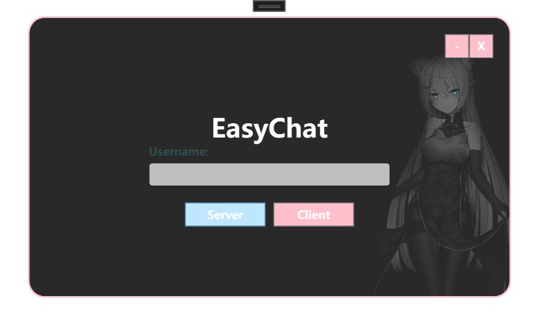
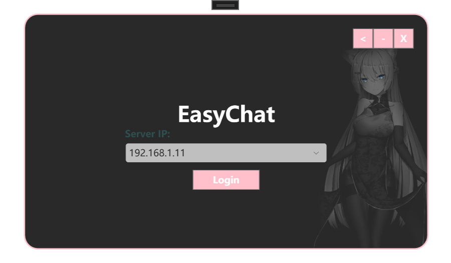
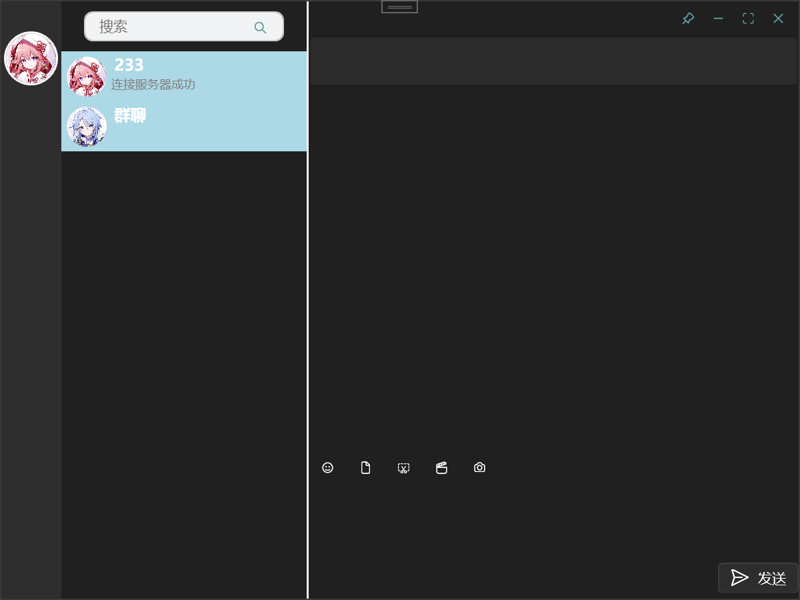
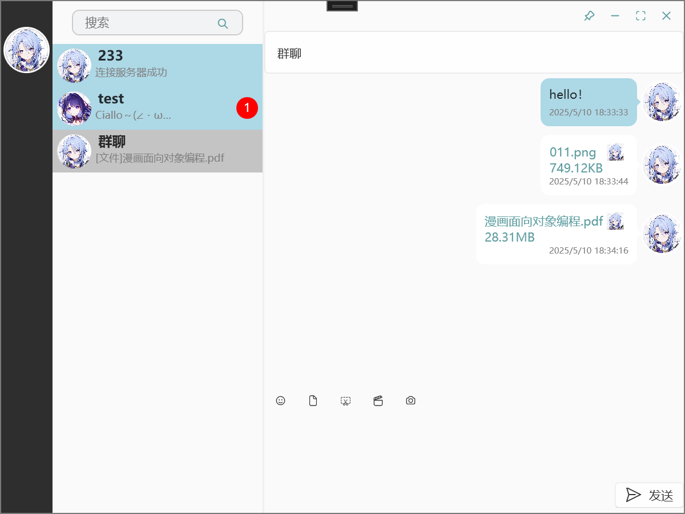

# EasyChat

本程序实现了MQTT在局域网中不同客户端互相通讯的功能，主界面使用WPF模仿微信主界面绘制。主要用到的技术栈：MVVM、MQTT、WPF.Ui

> 界面预览：

  
  

  
  

> 使用方法：
1.在局域网中任意一台电脑(最好是性能最好的一台)上运行EasyChat.exe，点击server按钮，作为服务端登录；
2.记录登录时显示的IP地址，其他电脑运行EasyChat.exe，点击client按钮，输入服务端IP地址，作为客户端登录；
3.然后就可以在局域网中互相聊天了。

> 优点：

1. 无需连接外网，适合局域网使用，例如车间调试工程师；
2. 没有数据库，不会存储聊天记录，安全无监控；
3. 使用AES对称加密算法加密消息体，不怕抓包。
4. 软件体积小，占用磁盘空间10M左右（其中一大半是UI资源）

> 缺点：

1. 仅支持Windows系统。

> 已有功能：

- [x] UI:炫酷的登录界面
- [x] UI:炫酷的主界面
- [x] 头像功能
- [x] 顶部图标功能:固定、最小化、最大化、隐藏
- [x] 新消息提醒功能
- [x] 实现聊天功能
- [x] 可以给自己发消息，默认给自己置顶
- [x] 群聊功能
- [x] 搜索功能
- [ ] 任务栏添加鼠标悬浮展示新消息内容功能
- [x] 支持主题切换
- [x] 支持头像切换
- [x] 图片文件发送接收功能
- [x] 支持同时发送多个文件或图片
- [x] 图片缩略图展示
- [x] 支持鼠标拖拽文件或者图片发送
- [x] 好友添加备注功能
- [x] 屏幕共享(支持群聊屏幕共享)
